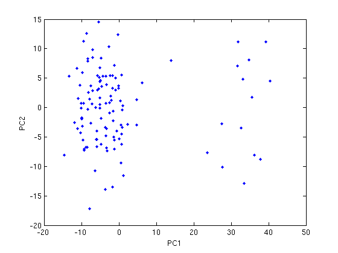

# PRINCIPAL COMPONENT ANALYSIS FOR ANALYSING MD TRAJECTORIES

I wanted to explain the process of implementing PCA (Principal Component Analysis) on your MD (molecular dynamics) trajectories. Here I do it on NAMD generated DCD files. The example files are taken from [here](http://thegrantlab.org/bio3d/tutorials/trajectory-analysis). This tutorial can be considered as a Matlab version of the bio3d R package tutorial example from [Grant Lab](http://thegrantlab.org/). The steps are as below :

1\. Access the files using readdcd command. This is not a Matlab provided command. You can download it from [here](http://www.ks.uiuc.edu/Development/MDTools/matdcd/)

2\. The hivp.dcd and hicp.pdb files in the Grant Lab example can be downloaded from [here](https://github.com/cran/bio3d/tree/master/inst/examples)

3\. FIT THE DCD files. THIS IS REALLY IMPORTANT. I DID IT USING tcl scripting in VMD.

4\. Then you may use PRINCOMP command as below to do PCA. VOILA!!

PRINCOMP requires Statistics toolbox, so I will explain a method with no princomp in future, when time permits. :D

<pre class="codeinput">clear,close,clc

xyz=readdcd('/home/devanandt/Documents/RAS/1C1Y/DATA/1C1Y/ANALYSIS/fitted_DCD/only_Carbon_alphas_dcd/ANALYSIS/fitted_hivp.dcd',1:198); % FITTING DCD IS REALLY REALLY IMPORTANT !!!!!!!!!

[pc, score, latent, tsquare] = princomp(xyz(2:end,:));

plot(score(:,1),score(:,2),'.')
xlabel('PC1')
ylabel('PC2')

latent(1)/sum(latent)% PC1 percentage
latent(2)/sum(latent)% PC2 percentage
latent(3)/sum(latent)% PC3 percentage
</pre>

<pre class="codeoutput">h = 

                  fid: 3
            endoffile: 290084
                 NSET: 118
               ISTART: 0
                NSAVC: 1
                NAMNF: 0
               charmm: 1
    charmm_extrablock: 1
         charmm_4dims: 0
                DELTA: 1
                    N: 198

ans =

    0.3859

ans =

    0.0897

ans =

    0.0510

</pre>

 

